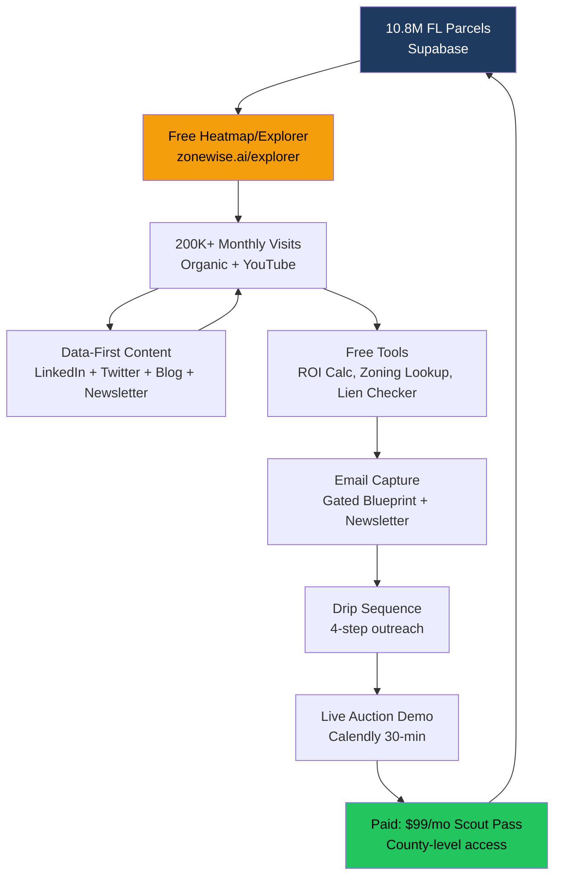

# CLAUDE.md — ZoneWise GTM Marketing Agent Squad
## Root Directive for Claude Code on Hetzner 87.99.129.125

---

## MISSION
Build Phase 1 of the 44-agent marketing pipeline for ZoneWise.AI.
This is NOT a generic marketing platform. This is the **Reventure.app flywheel model** applied to Florida real estate intelligence.

## SESSION HYGIENE
- MANDATORY: Context7 plugin + CC Status Line
- 50% RULE: kill at ~50% context. NEVER /compact.
- $10/session MAX.
- TODO.md Protocol: load → find unchecked → execute → mark [x] → push.

## THE REVENTURE FLYWHEEL (OUR CORE MODEL)



### How Reventure Does It (Our Blueprint)
```yaml
reventure_model:
  traffic_driver: Free choropleth heatmap (county/ZIP Zillow data)
  monthly_visits: 200K+
  youtube: Nick Gerli publishes data-driven RE videos
  conversion_trigger: Parcel-level detail gated after 5 free views
  pricing: $8.25/mo annual, $16/mo monthly
  estimated_arr: $17.6M (30K premium × $49 × 12)
  key_insight: "Free data visualization IS the marketing"

our_adaptation:
  traffic_driver: Free FL zoning/parcel explorer (choropleth + search)
  data_source: 10.8M FL parcels (NOT Zillow — government data)
  youtube_equivalent: "What AI Sees" weekly data videos
  conversion_trigger: Full property report gated after 5 free lookups
  pricing: Scout Pass $99/mo per county
  flywheel_tables: content_library, engagement_metrics, conversion_attribution, flywheel_metrics, leads
  key_insight: "Our data IS the content. Every parcel = a page. Every auction = a story."
```

### Existing Repos to Integrate
```yaml
reventure_repos:
  - breverdbidder/reventure-clone-v2    # Zillow CSV URLs + ETL pipeline
  - breverdbidder/reventure-agent       # Reverse engineering agents
  - breverdbidder/biddeed-housing-map   # Map.jsx choropleth patterns
existing_flywheel_code:
  - brevard-bidder-scraper/marketing/flywheel_content_generator.py
  - brevard-bidder-scraper/workflows/sales_agent_pipeline.yml
  - zonewise-web/src/components/ChatWidget.tsx  # NLP chat panel
  - zonewise-web/docs/plans/EXPLORER_V2_SPEC.md # Explorer V2 with conversion funnel
```

## ARCHITECTURE

```yaml
orchestration: GitHub Actions (SUMMIT dispatch)
llm_routing: Smart Router (Gemini FREE → DeepSeek CHEAP → Claude QUALITY)
storage: Supabase (marketing_* tables — migration ready at migrations/20260327_marketing_tables.sql)
monitoring: Sentinel (5min cron, auto-heal)
evals: AUTOLOOP nightly (2AM EST)
publishing: Blotato API (LinkedIn + Twitter/X)
email: Resend API (newsletter + drip sequences)
notifications: Telegram @BidDeedAI_bot
cost_cap: $10/session MAX
brand: config/brand_voice.yaml (Navy #1E3A5F, Orange #F59E0B)
shabbat: ZERO content Friday sunset → Saturday havdalah
```

## SUPABASE
- URL: `https://mocerqjnksmhcjzxrewo.supabase.co`
- Credentials SSOT: `brevard-bidder-scraper/docs/SUPABASE_CREDENTIALS.md`
- Migration: `migrations/20260327_marketing_tables.sql` (16 tables, run first)
- Existing flywheel tables: content_library, engagement_metrics, conversion_attribution, flywheel_metrics, leads

## PHASE 1 SESSION TASKS

### Step 0: Read Specs
```bash
cat docs/agents/MARKETING-AGENT-SQUAD.md   # Full 44-agent spec
cat docs/recon/AITOPIA-RECON.md             # AI Topia competitive intel
cat config/brand_voice.yaml                  # Brand rules
cat TODO.md                                  # Checklist
```

### Step 1: Run SQL Migration
```bash
# Run migrations/20260327_marketing_tables.sql against Supabase
# Verify: SELECT count(*) FROM information_schema.tables WHERE table_name LIKE 'marketing_%';
# Expected: 16 tables
```

### Step 2: Build Common Modules
```
agents/
├── common/
│   ├── __init__.py
│   ├── supabase_client.py    # Async client, connection pooling
│   ├── smart_router.py       # 3-tier: Gemini FREE (90%) → DeepSeek CHEAP → Claude QUALITY
│   ├── brand_voice.py        # Validate against config/brand_voice.yaml, score 1-10
│   ├── cost_tracker.py       # Track token spend per agent, enforce $10 cap
│   └── shabbat.py            # Is it Shabbat? Block publishing if yes.
```

### Step 3: Build First 5 Agents (Prove the Flywheel)
These 5 agents create the minimum viable content loop:

```
agents/
├── content/
│   ├── data_storyteller.py   # 2.10 — Query Supabase → narrative (OUR UNFAIR ADVANTAGE)
│   ├── linkedin.py           # 2.5 — 3 post types from data stories
│   └── twitter.py            # 2.6 — Threads from data stories
├── distribution/
│   ├── orchestrator.py       # 4.1 — Queue → Blotato publish
│   └── social_scheduler.py   # 4.2 — Optimal times, Shabbat-aware
```

#### Data Storyteller (Agent 2.10) — THE KEY AGENT
```python
# This is the agent that makes us different from AI Topia.
# They generate content from web scraping.
# We generate content from PROPRIETARY DATA.
#
# Input: Supabase queries (county_conquest_status, historical_auctions, zoning_assignments)
# Output: marketing_data_stories table
#
# Example narratives:
# - "327,882 parcels verified in Brevard — 93.3% of every property mapped"
# - "19 foreclosures analyzed Dec 3. 4 BID, 3 REVIEW, 12 SKIP. AI found liens on 6."
# - "Palm Bay zoning: 78,660 parcels confirmed. Melbourne gap: 10,626 remaining."
# - "This week: 47 auction properties. Average judgment: $228K. Our max bid avg: $142K."
#
# NEVER-LIE: Every number must come from a real Supabase query.
# Template: "{stat} → {insight} → {so_what_for_investor}"
```

#### LinkedIn Agent (Agent 2.5) — Reventure-Style Data Posts
```python
# Mimic Reventure/Nick Gerli LinkedIn style:
# - Lead with a surprising data point
# - Show the trend (up/down/sideways)
# - Explain what it means for FL RE investors
# - Soft CTA to free tool or newsletter
#
# 3 post types rotating:
# 1. DATA POST: Live stat from Supabase (Mon)
# 2. INSIGHT POST: Industry take on FL market (Wed)
# 3. TOOL POST: Free tool promo with screenshot (Fri)
#
# Publish via Blotato at Tue/Thu 8AM EST (highest LinkedIn engagement)
```

### Step 4: Build First GHA Workflow
```yaml
# .github/workflows/marketing-content-daily.yml
name: Marketing Content Daily
on:
  schedule:
    - cron: '0 12 * * 1-5'  # 7AM EST Mon-Fri (UTC 12:00)
  workflow_dispatch:

jobs:
  generate-content:
    runs-on: ubuntu-latest
    steps:
      - uses: actions/checkout@v4
      - uses: actions/setup-python@v5
        with:
          python-version: '3.12'
      - name: Install deps
        run: pip install httpx supabase anthropic google-generativeai pyyaml --break-system-packages
      - name: Data Storyteller
        env:
          SUPABASE_URL: ${{ secrets.SUPABASE_URL }}
          SUPABASE_KEY: ${{ secrets.SUPABASE_SERVICE_ROLE_KEY }}
          GEMINI_API_KEY: ${{ secrets.GEMINI_API_KEY }}
        run: python agents/content/data_storyteller.py
      - name: LinkedIn Agent
        env:
          SUPABASE_URL: ${{ secrets.SUPABASE_URL }}
          SUPABASE_KEY: ${{ secrets.SUPABASE_SERVICE_ROLE_KEY }}
          GEMINI_API_KEY: ${{ secrets.GEMINI_API_KEY }}
        run: python agents/content/linkedin.py
      - name: Brand Voice Check
        run: python agents/knowledge/brand_voice_keeper.py
      - name: Publish Queue
        env:
          BLOTATO_API_KEY: ${{ secrets.BLOTATO_API_KEY }}
        run: python agents/distribution/orchestrator.py
      - name: Telegram Notify
        env:
          TELEGRAM_BOT_TOKEN: ${{ secrets.TELEGRAM_BOT_TOKEN }}
          TELEGRAM_CHAT_ID: ${{ secrets.TELEGRAM_CHAT_ID }}
        run: |
          python3 -c "
          import httpx, os
          msg = '📢 Marketing Daily: Content generated and queued for publish.'
          httpx.post(f'https://api.telegram.org/bot{os.environ[\"TELEGRAM_BOT_TOKEN\"]}/sendMessage',
            json={'chat_id': os.environ['TELEGRAM_CHAT_ID'], 'text': msg})
          "
```

### Step 5: Build Eval Files for AUTOLOOP
```
eval/
├── content/
│   ├── data_storyteller.json   # 25 assertions: stat present, source=supabase, not fabricated, brand voice
│   └── linkedin.json           # 25 assertions: <300 chars, CTA present, no shabbat, brand score >= 7
└── distribution/
    └── orchestrator.json       # 25 assertions: correct platform, UTM present, scheduled, not duplicate
```

### Step 6: Build Free Tools (Reventure Lead Magnets)
```
# On zonewise-web repo (separate deploy):
# 1. /tools/zoning-lookup    — Enter FL address → zoning + allowed uses (from Supabase)
# 2. /tools/roi-calculator    — Enter price/ARV → max bid formula output
# 3. /tools/lien-checker      — Enter case# → lien priority stack
#
# These are the Reventure equivalent of the free heatmap.
# They drive organic traffic → email capture → conversion.
# Gate: 5 free uses → email required for unlimited.
```

## WHAT MAKES US DIFFERENT FROM AI TOPIA

```yaml
ai_topia_generates_from: web_scraping + generic_llm_calls
we_generate_from: 10.8M_FL_parcels + 1393_auction_records + 67_county_conquest + proprietary_ML

ai_topia_flywheel: content → SEO traffic → demo → $2500/mo
our_flywheel: data → free_tools → content → traffic → email → drip → demo → $99/mo_scout_pass

ai_topia_content: generic_marketing_articles
our_content: data_stories_no_one_else_can_tell (NEVER-LIE verified)

ai_topia_monitoring: none
our_monitoring: Sentinel_self_healing + AUTOLOOP_nightly_evals

ai_topia_cost: $300-600/mo_tools
our_cost: ~$200/mo_tools + 90%_FREE_tier_Gemini
```

## COMMIT CONVENTION
```
feat(agents): data_storyteller — query Supabase stats → narrative
feat(agents): linkedin — 3 post types from data stories
feat(workflow): marketing-content-daily.yml — 7AM EST Mon-Fri
feat(eval): data_storyteller.json — 25 AUTOLOOP assertions
fix(agents): brand_voice score threshold 7 → reject and retry
```

## SUCCESS CRITERIA (End of Session)
- [ ] 16 marketing_* Supabase tables exist and verified
- [ ] agents/common/ — 5 shared modules working
- [ ] agents/content/data_storyteller.py — generates real narratives from Supabase
- [ ] agents/content/linkedin.py — produces 3 branded LinkedIn posts
- [ ] agents/distribution/orchestrator.py — queues to marketing_social_posts
- [ ] .github/workflows/marketing-content-daily.yml — runs on schedule
- [ ] eval/content/data_storyteller.json — 25 binary assertions
- [ ] First 3 LinkedIn posts generated and in Supabase queue
- [ ] Telegram notification sent confirming pipeline works
