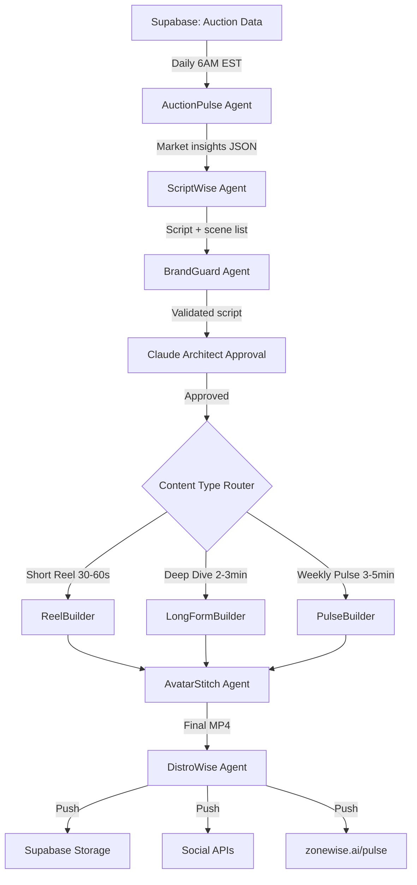

# ContentWise Engine — Design Spec v1.0
> March 26, 2026 | Everest Capital USA | CONFIDENTIAL
> Location: zonewise-gtm repo | Author: Claude AI Architect

## Mission
Automated daily content pipeline producing "Digital Ariel" branded real estate intelligence videos. 5-sec avatar intro + animated data content + avatar outro. Zero HITL except Claude Architect approval gate.

## Architecture



## Video Structure (All Types)

```yaml
video_structure:
  intro:
    duration: 5-8 sec
    source: HeyGen/D-ID (batch pre-rendered)
    content: "Digital Ariel" avatar speaking hook line
    examples:
      - "Here's what moved in Florida real estate today."
      - "Our AI analyzed 47 auctions this week. Here's what stands out."
      - "Three counties just saw unusual activity. Let me show you."
      - "This property tells an interesting story."
  
  body:
    duration: 20-180 sec (varies by type)
    source: Remotion on Hetzner (FREE, programmatic)
    content: Animated data visualizations
    types:
      - auction_heatmap: County activity map with animated hotspots
      - deal_breakdown: Property numbers flying in, before/after values
      - ml_scorecard: Prediction gauges, confidence meters, trend arrows
      - zoning_alert: Map flyover with zone overlays changing
      - market_pulse: Charts animating week-over-week, sparklines
      - investment_analysis: ROI waterfall, cap rate comparisons
      - property_report: Parcel zoom, zoning overlay, comparable sales
  
  outro:
    duration: 3-5 sec
    source: HeyGen/D-ID (batch pre-rendered)
    content: "Digital Ariel" avatar with CTA
    examples:
      - "That's your Florida real estate pulse. ZoneWise AI."
      - "Data-driven decisions. ZoneWise AI."
      - "The code is cracked. ZoneWise AI."
```

## Content Types

```yaml
content_calendar:
  daily:
    - type: auction_recap_reel
      duration: 30-60 sec
      structure: intro(5s) + heatmap_animation(20s) + top_deal(20s) + outro(5s)
      data_source: supabase.historical_auctions (previous day)
      trigger: cron 7AM EST (after auction data ingested)
    
    - type: property_spotlight
      duration: 45-60 sec  
      structure: intro(5s) + property_animation(35s) + investment_numbers(15s) + outro(5s)
      data_source: supabase.auction_results (notable deals)
      trigger: when deal meets threshold (bid/judgment > 75%)

  weekly:
    - type: market_pulse
      duration: 2-3 min
      structure: intro(8s) + county_heatmap(30s) + charts(45s) + ml_predictions(30s) + top_deals(30s) + outro(5s)
      data_source: supabase.daily_metrics (7-day rollup)
      trigger: Sunday 9AM EST
      
    - type: zoning_intelligence
      duration: 2-3 min
      structure: intro(8s) + map_flyover(40s) + zone_changes(40s) + feasibility_example(30s) + outro(5s)
      data_source: supabase.zoning_assignments (weekly delta)
      trigger: Monday 8AM EST

  monthly:
    - type: investment_deep_dive
      duration: 3-5 min
      structure: intro(8s) + market_overview(60s) + county_rankings(45s) + ml_accuracy(30s) + case_study(60s) + outro(8s)
      data_source: supabase.monthly_rollup
      trigger: 1st of month 9AM EST
```

## Agent Squad

```yaml
agents:
  auction_pulse:
    role: Data extraction + insight generation
    llm: Gemini Flash (FREE)
    input: Supabase auction tables
    output: JSON with insights, notable deals, trends, statistics
    cost: $0/day
    
  script_wise:
    role: Script writing from data insights
    llm: DeepSeek V3.2 ($0.28/1M tokens)
    input: AuctionPulse JSON + content_type template
    output: Timestamped script with scene descriptions
    cost: ~$0.01/day
    templates:
      reel: 3-5 sentences, punchy, data-forward
      deep_dive: narrator style, section headers, transitions
      pulse: summary + highlights + predictions

  brand_guard:
    role: Compliance + quality gate
    llm: Gemini Flash (FREE)
    checks:
      - Fair Housing Act compliance (no discriminatory language)
      - Data accuracy (numbers match source)
      - Brand voice (confident, data-driven, no hype)
      - Legal disclaimers present where needed
    cost: $0/day

  claude_architect:
    role: Final approval gate
    llm: Claude Sonnet (Max plan, FREE)
    method: Script review via Telegram notification
    actions: approve | edit | reject
    sla: 4 hours (auto-approve if no response + BrandGuard passed)
    cost: $0/day

  reel_builder:
    role: Programmatic video generation
    tool: Remotion (React-based video framework)
    host: Hetzner 87.99.129.125
    input: Approved script + scene list + data
    output: MP4 body segment (no avatar)
    components:
      - HeatmapScene: Mapbox + animated county fills
      - DealCard: Property photo + numbers flying in
      - ChartScene: Recharts animated (line, bar, gauge)
      - ScoreCard: ML confidence meters + trend arrows
      - ZoneOverlay: Mapbox + zoning layer transitions
      - TextOverlay: Key stats + branded lower thirds
    cost: $0/video (self-hosted)

  avatar_stitch:
    role: Combine avatar intro/outro with animated body
    tool: FFmpeg
    method: concat demuxer with crossfade transitions
    input: pre-rendered_intro.mp4 + body.mp4 + pre-rendered_outro.mp4
    output: final_video.mp4 (branded, ready to publish)
    post_processing:
      - Add ZoneWise.AI watermark (bottom-right)
      - Add background music (royalty-free, low volume)
      - Normalize audio levels
      - Export 1080x1920 (vertical) + 1920x1080 (horizontal)
    cost: $0/video

  distro_wise:
    role: Multi-platform distribution
    tool: GitHub Actions + platform APIs
    targets:
      - supabase: brand-assets/content/{date}/
      - zonewise.ai: /pulse page (embedded)
      - linkedin: via API (organic post)
      - instagram: via API (reel)
      - youtube: via API (short)
      - tiktok: via API (future)
      - telegram: Everest channel
    cost: $0/day
```

## Avatar Intro Batch Strategy

```yaml
avatar_batch:
  method: Pre-render 15-20 intro variations via HeyGen/D-ID
  frequency: Once per month (or when new intros needed)
  credit_usage: ~3-4 HeyGen credits total
  monthly_cost: $0 (D-ID free) or $2-3 (HeyGen Creator)
  
  intro_variations:
    daily_hooks:
      - "Here's what moved in Florida real estate today."
      - "Our AI analyzed today's auctions. Here's what stands out."
      - "Good morning. Let's look at the numbers."
      - "Three things you need to know about today's market."
      - "The data is in. Let me show you what happened."
    
    weekly_hooks:
      - "This week's Florida real estate pulse."
      - "Seven days of auction data tell an interesting story."
      - "Welcome to your weekly market intelligence brief."
    
    monthly_hooks:
      - "Monthly deep dive. Let's break down the numbers."
      - "Thirty days of Florida real estate. Here's the full picture."
    
    property_hooks:
      - "This property caught our AI's attention."
      - "Let me walk you through this deal."
      - "Here's a case study from this week's auctions."
    
    outros:
      - "That's your Florida real estate pulse. ZoneWise AI."
      - "Data-driven decisions start here. ZoneWise AI."
      - "The code is cracked. ZoneWise dot AI."
      - "Real estate intelligence. Powered by AI and machine learning."
      - "Starting with Florida. Expanding nationwide. ZoneWise AI."
  
  storage:
    github: zonewise-gtm/assets/intros/
    supabase: brand-assets/intros/{variation_id}.mp4
  
  voice: en-US-GuyNeural (synthetic until real voice recorded)
  photo: ariel_shapira_headshot.jpg (full 770 photo)
```

## Remotion Component Library

```yaml
remotion_components:
  shared:
    - BrandedFrame: Navy bg, orange accents, Inter font, ZoneWise logo
    - LowerThird: Animated name/title bar
    - DataCounter: Number counting up animation
    - TransitionWipe: Branded slide transition
    - BackgroundMusic: Subtle royalty-free track mixer

  scenes:
    HeatmapScene:
      props: county_data[], metric (auctions|value|volume)
      animation: counties light up sequentially by activity level
      duration: 15-30 sec
      data: supabase.daily_metrics grouped by county

    DealBreakdown:
      props: property{address, judgment, bid, arv, repairs, roi}
      animation: numbers fly in left-to-right, gauge fills, profit bar grows
      duration: 15-25 sec
      data: supabase.auction_results single property

    MLScorecard:
      props: predictions[], accuracy_pct, top_factors[]
      animation: gauge needle sweeps, confidence bars fill, factors stack
      duration: 15-20 sec
      data: supabase.ml_predictions

    ChartTimeline:
      props: timeseries[], metric_name, period
      animation: line draws left-to-right, points pulse, trend arrow appears
      duration: 10-20 sec
      data: supabase.daily_metrics time series

    ZoneMapFlyover:
      props: parcel_id, zone_code, setbacks, permitted_uses[]
      animation: map zooms to parcel, zone overlay fades in, callouts appear
      duration: 20-30 sec
      data: supabase.zoning_assignments + Mapbox

    InvestmentWaterfall:
      props: arv, purchase, repairs, holding, profit
      animation: waterfall bars cascade down, profit bar highlights green
      duration: 15-20 sec
      data: computed from auction_results

    CountyRanking:
      props: counties[]{name, score, delta}
      animation: horizontal bars race/sort, delta arrows flash
      duration: 15-25 sec
      data: supabase.county_conquest_status
```

## Cost Summary

```yaml
monthly_costs:
  data_pipeline: $0 (Supabase free tier)
  script_generation: ~$0.30 (DeepSeek, 30 scripts/mo)
  brand_validation: $0 (Gemini Flash free)
  approval_gate: $0 (Claude Max plan)
  avatar_intros: $0-3 (D-ID free or minimal HeyGen)
  video_rendering: $0 (Remotion on Hetzner, already paid)
  stitching: $0 (FFmpeg)
  distribution: $0 (GitHub Actions)
  total: $0.30 - $3.30/month

  versus:
    d_id_pro: $28.99/mo for 15 min (10 videos)
    heygen_creator: $24/mo unlimited but watermark-free
    traditional_video: $500-2000/mo freelancer
    savings: 99% vs traditional, 90% vs platform-only approach
```

## File Structure (zonewise-gtm repo)

```
zonewise-gtm/
├── assets/
│   ├── intros/              # Pre-rendered avatar intros
│   ├── outros/              # Pre-rendered avatar outros
│   ├── music/               # Royalty-free background tracks
│   └── brand/               # Logos, fonts, color refs
├── content-engine/
│   ├── agents/
│   │   ├── auction_pulse.py
│   │   ├── script_wise.py
│   │   ├── brand_guard.py
│   │   └── distro_wise.py
│   ├── remotion/
│   │   ├── package.json
│   │   ├── src/
│   │   │   ├── Root.tsx
│   │   │   ├── scenes/
│   │   │   │   ├── HeatmapScene.tsx
│   │   │   │   ├── DealBreakdown.tsx
│   │   │   │   ├── MLScorecard.tsx
│   │   │   │   ├── ChartTimeline.tsx
│   │   │   │   ├── ZoneMapFlyover.tsx
│   │   │   │   ├── InvestmentWaterfall.tsx
│   │   │   │   └── CountyRanking.tsx
│   │   │   └── components/
│   │   │       ├── BrandedFrame.tsx
│   │   │       ├── LowerThird.tsx
│   │   │       ├── DataCounter.tsx
│   │   │       └── TransitionWipe.tsx
│   │   └── render.sh
│   ├── stitch/
│   │   └── avatar_stitch.sh    # FFmpeg concat + crossfade
│   ├── templates/
│   │   ├── reel_template.yaml
│   │   ├── deep_dive_template.yaml
│   │   └── pulse_template.yaml
│   └── workflows/
│       ├── daily_content.yml    # GHA: 7AM EST trigger
│       ├── weekly_pulse.yml     # GHA: Sunday 9AM EST
│       └── monthly_dive.yml     # GHA: 1st of month
├── docs/
│   └── CONTENTWISE_ENGINE_SPEC.md
└── GTM_PLAYBOOK.md
```

## Implementation Phases

```yaml
phase_1_foundation:
  duration: 1 week
  tasks:
    - Initialize Remotion project in zonewise-gtm/content-engine/remotion/
    - Build BrandedFrame + LowerThird + DataCounter components
    - Build HeatmapScene (first scene, Mapbox integration)
    - Build DealBreakdown scene
    - Test render pipeline on Hetzner
    - Batch render 15 avatar intros via D-ID API (4 credits left)
    - FFmpeg stitch script
  deliverable: First automated daily reel (auction recap)

phase_2_agents:
  duration: 1 week
  tasks:
    - Build AuctionPulse agent (Gemini Flash)
    - Build ScriptWise agent (DeepSeek V3.2)
    - Build BrandGuard agent (Gemini Flash)
    - Wire approval gate (Telegram notification)
    - GHA daily_content.yml workflow
    - Test full pipeline end-to-end
  deliverable: Fully automated daily pipeline

phase_3_expansion:
  duration: 1 week
  tasks:
    - Build remaining Remotion scenes (MLScorecard, ChartTimeline, ZoneMapFlyover, InvestmentWaterfall, CountyRanking)
    - Build weekly pulse + monthly deep dive workflows
    - Build DistroWise agent (social API integrations)
    - Add background music mixing
    - Add vertical (9:16) + horizontal (16:9) dual export
  deliverable: Full content calendar automated

phase_4_voice:
  duration: when ready
  tasks:
    - Record Ariel voice sample
    - Clone via ElevenLabs free tier
    - Re-render avatar intros with real voice
    - Upgrade to HeyGen if quality needed
  deliverable: Digital Ariel with real voice
```

## Success Metrics

```yaml
metrics:
  day_30:
    daily_reels_published: 1/day
    weekly_pulse: 1/week
    human_time_per_day: 0 min (auto-approve if BrandGuard passes)
    cost: <$5 total
  
  day_60:
    daily_content_pieces: 2-3/day (reel + spotlight)
    social_reach: 1000+ impressions/week
    email_subscribers_from_content: 50+
    cost: <$5 total
  
  day_90:
    content_library: 100+ videos
    ariel_recognized_as: "AI real estate intelligence" thought leader
    inbound_leads_from_content: 10+
    cost: <$10 total
```
