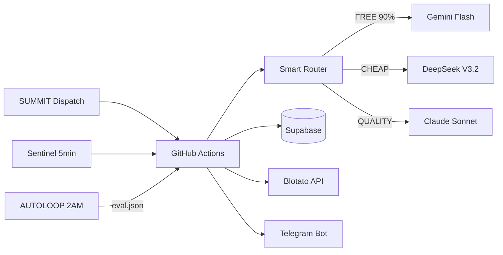

# ZoneWise Marketing Agent Squad
## Enhanced from AI Topia Recon + Our Stack Advantages
## SUMMIT Dispatch Spec — March 27, 2026

---

## ARCHITECTURE

All agents follow HARNESS.md 7-phase pipeline from cli-anything-biddeed.
Each agent = 1 Python file + 1 eval.json (25 assertions) + AUTOLOOP compatible.

```yaml
orchestration: GitHub Actions (SUMMIT dispatch)
llm_routing: Smart Router (Gemini FREE → DeepSeek CHEAP → Claude QUALITY)
storage: Supabase (marketing_* tables)
monitoring: Sentinel (5min cron, auto-heal)
evals: AUTOLOOP nightly (2AM EST)
publishing: Blotato API (LinkedIn + Twitter/X)
notifications: Telegram @BidDeedAI_bot
cost_cap: $10/session MAX
```



---

## SQUAD 1: SEO INTELLIGENCE (10 Agents)
### Theirs: 8 → Ours: 10 (+2 enhancements)

### 1.1 Keyword Research Agent
```yaml
their_version: Seeds → clustered keyword maps via DataForSEO
our_enhancement: |
  Seeds FROM OUR DATA. Mine 10.8M parcel records for real search patterns.
  "satellite beach zoning R-1" has real volume because people search actual
  addresses and districts. Our Supabase data IS the keyword source.
  They guess keywords. We KNOW what exists.
file: agents/seo/keyword_research.py
llm_tier: FREE (Gemini)
input: Supabase zoning_assignments + fl_counties + Google Trends API
output: Supabase marketing_keywords (keyword, volume_est, difficulty, cluster, parcel_source)
schedule: weekly Sunday 3AM EST
```

### 1.2 Keyword Validator
```yaml
their_version: Check real metrics before pipeline entry
our_enhancement: |
  Cross-validate against DataForSEO AND our actual Supabase query logs.
  When we launch free tools, every search = real demand signal.
  Real user searches > estimated search volume.
file: agents/seo/keyword_validator.py
llm_tier: FREE (Gemini)
input: marketing_keywords + DataForSEO API
output: marketing_keywords.validated=true/false, real_volume field
schedule: after keyword_research completes
```

### 1.3 Topic Discovery Agent
```yaml
their_version: Mine 7 sources for content angles
our_enhancement: |
  Mine 10 sources — their 7 plus: FL county commission agendas (zoning
  changes), foreclosure docket feeds (new filings), and our own
  conquest pipeline (new counties = new content angles). Every county
  conquest = automatic topic generation.
file: agents/seo/topic_discovery.py
llm_tier: FREE (Gemini)
input: Google Trends + Reddit + county_conquest_status + fl_counties + RealForeclose RSS
output: marketing_topics (topic, source, score, freshness, county_relevance)
schedule: daily 4AM EST
```

### 1.4 Gap Analyzer
```yaml
their_version: Cross-reference coverage vs top competitors
our_enhancement: |
  Compare against Gridics, Zoneomics, Regrid, PropertyOnion content.
  ALSO compare against county assessor sites — they have content gaps
  we can fill with better UX. Our 10.8M parcel advantage = content
  that competitors literally cannot produce without our data.
file: agents/seo/gap_analyzer.py
llm_tier: CHEAP (DeepSeek — needs reasoning)
input: marketing_topics + competitor sitemap crawl results
output: marketing_content_gaps (gap, competitor_url, our_opportunity, priority_score)
schedule: weekly Monday 5AM EST
```

### 1.5 Trend Collector
```yaml
their_version: Monitor Google Trends + rising queries
our_enhancement: |
  Add FL-specific signals: county commission meeting agendas (zoning
  amendments), foreclosure filing spikes, interest rate announcements,
  insurance crisis news. Florida RE has unique trend drivers they
  cannot detect with generic trend monitoring.
file: agents/seo/trend_collector.py
llm_tier: FREE (Gemini)
input: Google Trends API + FL news RSS + county_commission_feeds
output: marketing_trends (trend, signal_strength, fl_relevance, decay_rate)
schedule: daily 5AM EST
```

### 1.6 AEO Visibility Scanner
```yaml
their_version: Track AI Overview, snippets, PAA presence
our_enhancement: |
  Track ZoneWise presence in ChatGPT, Claude, Perplexity, Gemini
  responses for FL zoning queries. Also track BidDeed.AI for
  foreclosure queries. Log what AI models say about us vs competitors.
  This is GEO (Generative Engine Optimization) — they track it, we
  track it + our vertical-specific queries.
file: agents/seo/aeo_scanner.py
llm_tier: FREE (Gemini)
input: Target query list + Perplexity API + manual AI probes
output: marketing_aeo_visibility (query, platform, mentioned, position, sentiment)
schedule: weekly Wednesday 6AM EST
```

### 1.7 Rank Tracker
```yaml
their_version: Monitor positions, flag drops
our_enhancement: |
  Track positions + correlate with content publishes and competitor
  moves. Auto-alert on drops > 5 positions. Auto-trigger content
  refresh workflow when rankings decline. CLOSED LOOP — not just
  monitoring, but auto-remediation.
file: agents/seo/rank_tracker.py
llm_tier: FREE (Gemini)
input: DataForSEO rank data + marketing_keywords
output: marketing_rankings (keyword, position, delta, auto_action_triggered)
schedule: daily 6AM EST
trigger: position_drop > 5 → auto-dispatch content_refresh workflow
```

### 1.8 Site Auditor
```yaml
their_version: GSC + GA4 health scan with quick-win detection
our_enhancement: |
  Full technical audit + CONTENT audit. Check every page for:
  broken links, thin content, missing schema, slow images.
  ALSO check our programmatic pages (67 county pages, district pages)
  for data staleness — if Supabase data updated but page didn't
  regenerate, flag it. Sentinel-style self-healing for content.
file: agents/seo/site_auditor.py
llm_tier: FREE (Gemini)
input: GSC API + GA4 API + Supabase page_freshness
output: marketing_audit_issues (url, issue_type, severity, auto_fixable)
schedule: weekly Saturday 7AM EST
```

### 1.9 ★ NEW: Programmatic Page Generator
```yaml
their_version: DOES NOT EXIST — they generate articles, not data pages
our_enhancement: |
  Auto-generate SEO pages from Supabase data. One page per:
  - FL county (67 pages)
  - Zoning district type (50+ pages)
  - City/municipality (400+ pages)
  - Top searched addresses (dynamic)
  Total: 500+ programmatic pages. They write 60-80 articles/month.
  We GENERATE 500+ data pages from our existing DB. Unbeatable.
file: agents/seo/programmatic_page_gen.py
llm_tier: FREE (Gemini — template fill, minimal LLM)
input: fl_counties + zoning_assignments + county_conquest_status
output: /pages/counties/[county].tsx + /pages/zoning/[district].tsx on zonewise.ai
schedule: on county_conquest completion
```

### 1.10 ★ NEW: Internal Link Builder
```yaml
their_version: Internal Link Finder (in Knowledge pillar, passive)
our_enhancement: |
  ACTIVE internal linking. When new programmatic page is generated,
  automatically find and insert cross-links to related pages.
  County page → links to its districts → links to nearby counties.
  Build a link graph that Google crawls deeply. Their version suggests
  links. Ours INSERTS them automatically.
file: agents/seo/internal_link_builder.py
llm_tier: FREE (Gemini)
input: sitemap + page content + Supabase geo relationships
output: Auto-inserted <a> tags in programmatic pages
schedule: after programmatic_page_gen completes
```

---

## SQUAD 2: CONTENT PRODUCTION (11 Agents)
### Theirs: 9 → Ours: 11 (+2 enhancements)

### 2.1 Content Director
```yaml
their_version: Orchestrates full pipeline from opportunity to publish
our_enhancement: |
  Reads from marketing_topics + marketing_content_gaps + marketing_trends.
  Auto-selects format based on topic type:
  - Data insight → LinkedIn post + blog
  - Trend alert → Twitter thread + newsletter
  - County conquest → Blog + programmatic page + social
  - Auction preview → Newsletter + video script
  ALSO enforces $10/session cost cap across all child agents.
file: agents/content/director.py
llm_tier: FREE (Gemini — routing only)
input: marketing_topics + marketing_trends + marketing_content_gaps
output: marketing_content_queue (topic, format, assigned_agent, priority, cost_budget)
schedule: daily 7AM EST (after SEO agents complete)
```

### 2.2 Article Planner
```yaml
their_version: Structured outlines with competitive intelligence
our_enhancement: |
  Outlines include DATA SECTIONS that pull live from Supabase.
  "Top 5 zoning districts in [County]" isn't generated text — it's
  a query result. Every article has a data-backed section that no
  competitor can replicate without our 10.8M parcels.
file: agents/content/article_planner.py
llm_tier: CHEAP (DeepSeek — needs structure reasoning)
input: marketing_content_queue (articles only) + Supabase zoning data
output: marketing_article_outlines (title, h2s, data_queries, target_keyword, word_target)
schedule: triggered by director
```

### 2.3 Article Writer
```yaml
their_version: Publish-ready long-form drafts with brand voice
our_enhancement: |
  Brand voice enforced via system prompt with ZoneWise voice doc.
  Every article includes:
  - At least 1 Supabase data pull (live stats, not made up)
  - CTA to relevant free tool
  - Internal links to programmatic pages
  - Schema markup for FAQ/HowTo
  NEVER-LIE rule: every stat must trace to Supabase query.
file: agents/content/article_writer.py
llm_tier: QUALITY (Claude Sonnet — long-form quality matters)
input: marketing_article_outlines + brand_voice_doc + Supabase data
output: marketing_articles (title, body_md, meta_desc, schema, internal_links, cta)
schedule: triggered by planner
cost_note: Only agent using QUALITY tier. ~$0.50-1.00 per article.
```

### 2.4 Newsletter Agent
```yaml
their_version: Curate and format email content
our_enhancement: |
  "FL Zoning + Auction Weekly" — auto-assembled from:
  - This week's auction stats (from BidDeed pipeline)
  - County spotlight (rotating, from conquest data)
  - 1 unique data insight only we can publish
  - Top 3 content pieces from the week
  Template in Resend. Personalized per subscriber county interest.
file: agents/content/newsletter.py
llm_tier: FREE (Gemini — template fill)
input: marketing_articles (week) + historical_auctions + county_conquest_status
output: marketing_newsletters (subject, body_html, segment, send_date)
schedule: weekly Monday 8AM EST
send_via: Resend API
```

### 2.5 LinkedIn Agent
```yaml
their_version: Professional posts and thought leadership
our_enhancement: |
  3 post types rotating:
  1. DATA POST: "This week: 47 foreclosures in Brevard. 12 had liens
     the buyer didn't know about. Here's what AI found." (from Supabase)
  2. INSIGHT POST: Industry take on FL RE market
  3. TOOL POST: "Free tool: check any FL property's zoning in 5 seconds"
  All posts end with soft CTA. Never salesy. Data-first authority.
  Scheduled via Blotato at optimal times (Tue/Thu 8AM EST).
file: agents/content/linkedin.py
llm_tier: FREE (Gemini)
input: marketing_content_queue (linkedin) + Supabase stats
output: marketing_social_posts (platform=linkedin, body, image_prompt, schedule_time)
schedule: 3x/week (Mon, Wed, Fri mornings)
publish_via: Blotato API
```

### 2.6 Twitter/X Agent
```yaml
their_version: Viral-optimized threads
our_enhancement: |
  Thread types:
  1. AUCTION THREAD: Live auction day commentary (anonymized data)
  2. DATA THREAD: "I analyzed 1,393 Brevard foreclosures. Here's what I found."
  3. TOOL THREAD: Walkthrough of free tool with screenshots
  Threads auto-generated from articles (extract key points).
  Short-form tweets daily, threads 2x/week.
file: agents/content/twitter.py
llm_tier: FREE (Gemini)
input: marketing_content_queue (twitter) + marketing_articles
output: marketing_social_posts (platform=twitter, body, thread_parts, media)
schedule: daily 9AM EST
publish_via: Blotato API
```

### 2.7 Video Scriptwriter
```yaml
their_version: Short-form scripts for Reels/TikTok/Shorts
our_enhancement: |
  Scripts built around SCREEN RECORDINGS of our actual tools.
  "Watch AI analyze this property in 30 seconds" — show the
  BidDeed pipeline running, ZoneWise lookup happening.
  No avatar needed initially — screen capture + voiceover.
  HeyGen avatar for talking-head intros only (Phase 2).
file: agents/content/video_script.py
llm_tier: FREE (Gemini)
input: marketing_content_queue (video) + tool_demo_templates
output: marketing_video_scripts (title, script, scene_descriptions, duration_est)
schedule: 2x/week
```

### 2.8 Lead Magnet Agent
```yaml
their_version: Whitepapers, checklists, guides
our_enhancement: |
  Lead magnets that USE our data:
  1. "FL Foreclosure Market Report Q[X] 2026" — auto-generated from
     historical_auctions table. Real data, PDF, gated.
  2. "Zoning Cheat Sheet: [County]" — auto-generated from zoning_assignments.
     One per county = 67 lead magnets from 1 template.
  3. "The Investor's AI Toolkit" — guide to using our free tools.
  Gated behind email capture on zonewise.ai.
file: agents/content/lead_magnet.py
llm_tier: CHEAP (DeepSeek — structured doc generation)
input: Supabase historical_auctions + zoning_assignments + fl_counties
output: marketing_lead_magnets (title, type, pdf_url, gate_page_url)
schedule: monthly (reports) + on county_conquest (cheat sheets)
```

### 2.9 Image Creator
```yaml
their_version: On-brand visuals for every piece
our_enhancement: |
  Generate branded images using our house brand (Navy #1E3A5F, Orange
  #F59E0B). Types:
  - Blog hero images (data visualization style)
  - Social media cards (stat + branded frame)
  - Infographics from Supabase data
  Use Stitch API (from DesignWise squad) for generation.
  BrandGuard validates colors/fonts before publish.
file: agents/content/image_creator.py
llm_tier: FREE (Gemini for prompts) + Stitch API
input: marketing_content_queue + BRAND_COLORS.md
output: marketing_images (content_id, image_url, alt_text, brand_score)
schedule: triggered per content piece
```

### 2.10 ★ NEW: Data Storyteller
```yaml
their_version: DOES NOT EXIST
our_enhancement: |
  Turns raw Supabase queries into publishable narratives.
  "327,882 parcels verified in Brevard" → "We've mapped 93.3% of
  every property in Brevard County — including the ones your title
  company missed."
  This agent is our UNFAIR ADVANTAGE. They generate content from
  web scraping. We generate content from PROPRIETARY DATA.
file: agents/content/data_storyteller.py
llm_tier: CHEAP (DeepSeek)
input: Supabase county_conquest_status + historical_auctions + daily_metrics
output: marketing_data_stories (stat, narrative, visual_suggestion, platform_fit)
schedule: daily 7:30AM EST
```

### 2.11 ★ NEW: Content Recycler
```yaml
their_version: DOES NOT EXIST (they create net-new only)
our_enhancement: |
  Takes top-performing content (by engagement metrics from Blotato +
  GA4) and automatically reformats:
  - Blog → LinkedIn carousel
  - Thread → Newsletter section
  - Data story → Video script
  - Article → Lead magnet chapter
  One piece of content → 4+ formats automatically.
  They create parallel. We create AND recycle.
file: agents/content/recycler.py
llm_tier: FREE (Gemini)
input: marketing_articles (top 10 by engagement) + marketing_social_posts (top 10)
output: marketing_content_queue (recycled variants)
schedule: weekly Friday 8AM EST
```

---

## SQUAD 3: COMPETITOR INTELLIGENCE (7 Agents)
### Theirs: 5 → Ours: 7 (+2 enhancements)

### 3.1 Competitor Monitor
```yaml
their_version: Crawl competitor sitemaps daily
our_enhancement: |
  Crawl + DIFF. Store previous sitemap in Supabase. On each crawl,
  detect: new pages, removed pages, modified pages. Alert on new
  content within 1 hour. They detect. We detect + alert + auto-respond.
file: agents/competitor/monitor.py
llm_tier: FREE (no LLM needed — pure HTTP + diff)
input: competitor_sitemaps table + Apify/direct HTTP
output: marketing_competitor_changes (competitor, url, change_type, detected_at)
schedule: daily 2AM EST
targets: [gridics.com, zoneomics.com, regrid.com, propertyonion.com]
```

### 3.2 Content Extractor
```yaml
their_version: Pull titles, headings, word counts, meta
our_enhancement: |
  Extract + SCORE. For each new competitor page, extract content AND
  score it against our coverage. If they published about a topic we
  don't cover → auto-add to marketing_content_gaps as P0.
file: agents/competitor/extractor.py
llm_tier: FREE (Gemini — light analysis)
input: marketing_competitor_changes (new pages only)
output: marketing_competitor_content (url, title, h2s, word_count, topic, our_coverage_score)
schedule: triggered by monitor
```

### 3.3 Keyword Overlap Analyzer
```yaml
their_version: Detect where competitors target your keywords
our_enhancement: |
  Bidirectional analysis. Not just "where do they target us" but
  "where do THEY rank that we DON'T even target." Find their blind
  spots too. If Gridics ranks for "miami zoning lookup" and we have
  Miami-Dade data, that's a free content opportunity.
file: agents/competitor/keyword_overlap.py
llm_tier: FREE (Gemini)
input: marketing_keywords + DataForSEO competitor data
output: marketing_keyword_battles (keyword, our_position, their_position, gap_owner, action)
schedule: weekly Tuesday 4AM EST
```

### 3.4 Threat Assessor
```yaml
their_version: Score articles by competitive risk
our_enhancement: |
  Score + AUTO-RESPOND. If threat_score > 8 → auto-dispatch Content
  Director to create a response article within 24 hours. They
  monitor. We monitor + automatically counterattack.
file: agents/competitor/threat_assessor.py
llm_tier: CHEAP (DeepSeek — needs reasoning for scoring)
input: marketing_competitor_content + marketing_keyword_battles
output: marketing_threats (competitor, url, threat_score, auto_response_triggered)
schedule: triggered by extractor
auto_action: threat_score > 8 → dispatch content_director with counter_brief
```

### 3.5 AI-Suggested Competitors
```yaml
their_version: Discover competitors you didn't know about
our_enhancement: |
  Search for anyone ranking for our target keywords who ISN'T in our
  competitor list. Also monitor Product Hunt, Hacker News, Reddit
  for new RE/zoning tools launching. First-mover detection.
file: agents/competitor/discovery.py
llm_tier: FREE (Gemini)
input: marketing_keywords (top 50) + DataForSEO SERP results
output: marketing_new_competitors (domain, first_seen, overlap_score, threat_level)
schedule: monthly 1st of month
```

### 3.6 ★ NEW: Pricing Monitor
```yaml
their_version: DOES NOT EXIST
our_enhancement: |
  Track competitor pricing pages for changes. Gridics, Zoneomics,
  PropertyOnion pricing — detect increases, new tiers, feature
  changes. Auto-update our COMPETITIVE_ANALYSIS.md when prices change.
file: agents/competitor/pricing_monitor.py
llm_tier: FREE (no LLM — HTTP + diff)
input: competitor_pricing_urls table
output: marketing_pricing_changes (competitor, old_price, new_price, detected_at)
schedule: weekly Thursday 3AM EST
```

### 3.7 ★ NEW: Review & Sentiment Tracker
```yaml
their_version: DOES NOT EXIST
our_enhancement: |
  Monitor G2, Capterra, Reddit, Twitter for mentions of competitors
  AND us. Track sentiment over time. Detect negative reviews of
  competitors = opportunity for our outreach. Detect positive reviews
  = study what they're doing right.
file: agents/competitor/sentiment_tracker.py
llm_tier: FREE (Gemini)
input: competitor names + brand mentions from search
output: marketing_sentiment (source, entity, sentiment, quote_summary, opportunity_flag)
schedule: daily 5AM EST
```

---

## SQUAD 4: DISTRIBUTION & PUBLISHING (6 Agents)
### Theirs: Scattered across pillars → Ours: Dedicated squad

### 4.1 Publishing Orchestrator
```yaml
their_version: WordPress Publisher (single CMS)
our_enhancement: |
  Multi-target: zonewise.ai (Next.js/Vercel), blog (markdown → git),
  Blotato (social), Resend (email). One agent dispatches to all
  channels with format adaptation. ALSO handles scheduling —
  optimal times per platform (LinkedIn Tue/Thu 8AM, Twitter daily,
  blog Mon/Wed/Fri, newsletter Monday 9AM).
file: agents/distribution/orchestrator.py
llm_tier: FREE (no LLM — routing logic)
input: marketing_content_queue (status=approved)
output: marketing_published (content_id, platform, url, published_at)
schedule: continuous (checks queue every 30min)
```

### 4.2 Social Scheduler
```yaml
their_version: Blotato auto-publish (fire and forget)
our_enhancement: |
  Smart scheduling with engagement feedback loop. Track best
  performing times per platform from our analytics. Auto-adjust
  schedule based on actual engagement data. Never post during
  Shabbat (Friday sunset → Saturday havdalah).
file: agents/distribution/social_scheduler.py
llm_tier: FREE (no LLM)
input: marketing_social_posts + marketing_engagement_metrics + shabbat_times
output: Blotato API scheduled posts
schedule: daily 6AM EST (batch schedule for the day)
constraint: ZERO posts Friday sunset → Saturday havdalah
```

### 4.3 Email Distributor
```yaml
their_version: Newsletter agent handles email
our_enhancement: |
  Segmented sends. Subscribers tagged by county interest, investor
  type (foreclosure vs tax deed vs both), engagement level.
  Hot leads get demo invite CTA. Cold leads get educational content.
  All via Resend with tracking.
file: agents/distribution/email_distributor.py
llm_tier: FREE (no LLM — template merge)
input: marketing_newsletters + subscriber_segments
output: Resend API sends + marketing_email_metrics
schedule: triggered by newsletter agent
```

### 4.4 ★ NEW: Engagement Tracker
```yaml
their_version: DOES NOT EXIST as separate agent
our_enhancement: |
  Pull engagement data from ALL channels into single Supabase table:
  - Blotato API (likes, comments, shares per post)
  - GA4 (page views, time on page, bounce rate)
  - Resend (opens, clicks, unsubscribes)
  - GSC (impressions, clicks, CTR per page)
  Feed back into Content Recycler and Social Scheduler.
  CLOSED LOOP that their system lacks.
file: agents/distribution/engagement_tracker.py
llm_tier: FREE (no LLM — API pulls)
input: Blotato API + GA4 API + Resend API + GSC API
output: marketing_engagement_metrics (content_id, platform, metric, value, date)
schedule: daily 11PM EST
```

### 4.5 ★ NEW: UTM Manager
```yaml
their_version: DOES NOT EXIST
our_enhancement: |
  Auto-generate UTM parameters for every published link.
  utm_source=linkedin|twitter|email|blog
  utm_medium=social|newsletter|organic
  utm_campaign=auto-generated from content topic
  Track full attribution chain in GA4.
file: agents/distribution/utm_manager.py
llm_tier: FREE (no LLM — string formatting)
input: marketing_content_queue (any published item)
output: UTM-tagged URLs stored in marketing_published
schedule: triggered per publish
```

### 4.6 ★ NEW: A/B Headline Tester
```yaml
their_version: They have a free tool for users but don't use it internally
our_enhancement: |
  For every article/social post, generate 3 headline variants.
  Publish variant A first. If engagement below threshold after 24hrs,
  swap to variant B. Track winning patterns in Supabase.
  Self-improving headline quality over time.
file: agents/distribution/headline_tester.py
llm_tier: FREE (Gemini)
input: marketing_content_queue + marketing_engagement_metrics
output: marketing_headline_tests (content_id, variants, winner, improvement_pct)
schedule: 24hrs after each publish (evaluation)
```

---

## SQUAD 5: KNOWLEDGE & BRAND (5 Agents)
### Theirs: 7 → Ours: 5 (consolidated, more focused)

### 5.1 Brand Voice Keeper
```yaml
their_version: Ensure every agent writes in your tone
our_enhancement: |
  System prompt injection on EVERY content generation call.
  Voice doc defines: tone (authoritative but approachable), vocabulary
  (use "intelligence" not "data", "verified" not "scraped"),
  forbidden phrases (never "AI-powered" alone, always show what it does),
  Ariel's voice for LinkedIn (direct, data-first, no fluff).
  ALSO validates outputs before publish — reject if brand_score < 7/10.
file: agents/knowledge/brand_voice.py
llm_tier: FREE (Gemini — validation pass)
input: Any marketing_content before publish + brand_voice.yaml
output: brand_score (1-10) + revision_notes if < 7
schedule: triggered before every publish
```

### 5.2 RAG Knowledge Base
```yaml
their_version: Retrieve context before generation
our_enhancement: |
  Our RAG has PROPRIETARY data no competitor can match:
  - 10.8M parcel embeddings
  - 1,393 historical auction records
  - 67 county conquest status records
  - All previous marketing content (for consistency)
  Every content generation call gets relevant RAG context injected.
file: agents/knowledge/rag_engine.py
llm_tier: FREE (pgvector similarity search, no LLM needed)
input: Query from any agent + Supabase pgvector
output: Top-k relevant chunks injected into agent context
schedule: on-demand (called by other agents)
```

### 5.3 Document Ingester
```yaml
their_version: Process PDFs, docs, URLs into embeddings
our_enhancement: |
  Auto-ingest: county commission agendas (PDF), FL statute updates,
  new blog posts from competitors (for RAG context, not plagiarism).
  Also ingest our own published content to prevent repetition.
file: agents/knowledge/ingester.py
llm_tier: FREE (Gemini for chunking)
input: New documents + competitor blog feed + FL legal RSS
output: Supabase pgvector embeddings
schedule: daily 1AM EST
```

### 5.4 ★ NEW: Content Deduplication Agent
```yaml
their_version: DOES NOT EXIST
our_enhancement: |
  Before any content is published, check against ALL previous content
  for similarity. If > 70% similar to existing piece, flag and
  suggest merge or differentiation. Prevents the "content farm"
  problem where volume kills quality.
  NEVER-LIE applied to content: no recycled stats, no stale data.
file: agents/knowledge/deduplication.py
llm_tier: FREE (pgvector cosine similarity)
input: New content + marketing_articles (all previous)
output: similarity_score + duplicate_flag + differentiation_suggestions
schedule: triggered before every publish
```

### 5.5 ★ NEW: Performance Reporter
```yaml
their_version: DOES NOT EXIST as autonomous agent
our_enhancement: |
  Weekly digest to Telegram: content published, engagement metrics,
  top performers, SEO ranking changes, competitor moves, cost spent.
  Auto-generates a mini dashboard in Supabase for Ariel's 20-min review.
  Format: YAML (per CONTEXT COMPRESSION mandate).
file: agents/knowledge/performance_reporter.py
llm_tier: FREE (Gemini — summarization)
input: ALL marketing_* tables (week's data)
output: Telegram message + Supabase marketing_weekly_reports
schedule: Sunday 9AM EST (with weekly health digest)
```

---

## SQUAD 6: OUTREACH & SALES (5 Agents)
### Theirs: 7 → Ours: 5 (Phase 2, lean start)

### 6.1 Lead Finder
```yaml
their_version: Apollo multi-source scraping
our_enhancement: |
  Target FL RE investors specifically. Sources:
  - RealForeclose bidder lists (public auction participants)
  - BiggerPockets FL forums
  - LinkedIn "Florida real estate investor" profiles
  - County property records (frequent buyers)
  Our data gives us LEADS that Apollo can't — people who actually
  bid at foreclosure auctions are our exact ICP.
file: agents/outreach/lead_finder.py
llm_tier: FREE (no LLM — data queries)
input: historical_auctions (bidder data) + Apollo API + LinkedIn search
output: marketing_leads (name, company, email, source, icp_score)
schedule: weekly Monday 10AM EST
priority: P1 (Month 2)
```

### 6.2 Lead Enricher
```yaml
their_version: Email, company data, tech stack verification
our_enhancement: |
  Enrich with OUR data. If a lead has properties in Brevard,
  we know their portfolio from BCPAO. If they bid at auctions,
  we know their bid history. Personalization no competitor can match.
file: agents/outreach/lead_enricher.py
llm_tier: FREE (Gemini — light analysis)
input: marketing_leads + Supabase historical_auctions + BCPAO data
output: marketing_leads.enriched_data (portfolio_size, bid_history, county_activity)
schedule: triggered by lead_finder
priority: P1
```

### 6.3 Email Sequencer
```yaml
their_version: Automated cold email campaigns
our_enhancement: |
  4-step sequence (from GTM Playbook):
  1. Connect: "Saw you invest in FL auctions. Building free AI tool."
  2. Value: "Ran [County] through ZoneWise — [X] auctions analyzed."
  3. Demo: "Reply with a parcel ID, I'll run the full pipeline."
  4. Close: "$99/mo for your county. 14-day trial."
  Personalized with enriched data. Sent via Resend (not Instantly —
  save $30/mo).
file: agents/outreach/email_sequencer.py
llm_tier: CHEAP (DeepSeek — personalization)
input: marketing_leads (enriched) + email_templates
output: Resend API sends + marketing_outreach_log
schedule: daily 10AM EST (new leads enter sequence)
priority: P1
```

### 6.4 LinkedIn Connector
```yaml
their_version: Unipile-based LinkedIn automation
our_enhancement: |
  Manual-first approach (avoid LinkedIn jail). Agent DRAFTS connection
  requests and messages. Ariel sends manually OR we add Unipile later.
  Messages reference specific auction data: "I saw 47 properties in
  [County] last month. 12 had hidden liens. Want the report?"
file: agents/outreach/linkedin_connector.py
llm_tier: FREE (Gemini)
input: marketing_leads (linkedin_url present) + enriched data
output: marketing_linkedin_drafts (lead_id, message, connection_note)
schedule: 5 drafts/day max
priority: P2
```

### 6.5 ★ NEW: Demo Pipeline Agent
```yaml
their_version: DOES NOT EXIST as agent (manual Calendly only)
our_enhancement: |
  When a lead books a Calendly demo, auto-prepare:
  - Their county's latest auction data
  - 3 sample properties with full BidDeed analysis
  - Personalized slide with their name + portfolio data
  - Talking points for Ariel's 5-min demo script
  Ariel walks into every demo fully armed. Zero prep time.
file: agents/outreach/demo_pipeline.py
llm_tier: CHEAP (DeepSeek)
input: Calendly webhook + marketing_leads + Supabase auction data
output: marketing_demo_prep (lead_id, county_data, sample_properties, talking_points)
schedule: triggered on Calendly booking
priority: P1
```

---

## TOTAL AGENT COUNT

```yaml
squad_1_seo: 10 agents (theirs: 8, +2 new)
squad_2_content: 11 agents (theirs: 9, +2 new)
squad_3_competitor: 7 agents (theirs: 5, +2 new)
squad_4_distribution: 6 agents (all new — they scatter this across pillars)
squad_5_knowledge: 5 agents (theirs: 7, consolidated)
squad_6_outreach: 5 agents (theirs: 7, leaner start)
────────────────────────────────
TOTAL: 44 agents

improvements_over_topia:
  - 10 completely new agents they don't have
  - Every existing agent enhanced with our data moat
  - Closed-loop feedback (engagement → content optimization)
  - Auto-remediation (rank drops → auto-content refresh)
  - Auto-counterattack (competitor threats → auto-response)
  - NEVER-LIE data provenance on every stat
  - Sentinel self-healing on entire marketing pipeline
  - AUTOLOOP nightly evals on all agents
  - Shabbat-aware scheduling
  - $10/session cost cap enforced
```

## SUPABASE TABLES (New)

```sql
-- Marketing tables to create
CREATE TABLE marketing_keywords (id uuid PK, keyword text, volume_est int, difficulty int, cluster text, parcel_source text, validated bool, created_at timestamptz);
CREATE TABLE marketing_topics (id uuid PK, topic text, source text, score float, freshness text, county_relevance text[], created_at timestamptz);
CREATE TABLE marketing_content_gaps (id uuid PK, gap text, competitor_url text, our_opportunity text, priority_score int, created_at timestamptz);
CREATE TABLE marketing_trends (id uuid PK, trend text, signal_strength float, fl_relevance float, decay_rate text, created_at timestamptz);
CREATE TABLE marketing_content_queue (id uuid PK, topic_id uuid FK, format text, assigned_agent text, priority text, cost_budget float, status text, created_at timestamptz);
CREATE TABLE marketing_articles (id uuid PK, title text, body_md text, meta_desc text, schema_json jsonb, internal_links text[], cta text, brand_score float, created_at timestamptz);
CREATE TABLE marketing_social_posts (id uuid PK, platform text, body text, thread_parts text[], media_url text, schedule_time timestamptz, published bool, created_at timestamptz);
CREATE TABLE marketing_newsletters (id uuid PK, subject text, body_html text, segment text, send_date timestamptz, sent bool, created_at timestamptz);
CREATE TABLE marketing_published (id uuid PK, content_id uuid, platform text, url text, utm_params jsonb, published_at timestamptz);
CREATE TABLE marketing_engagement_metrics (id uuid PK, content_id uuid, platform text, metric text, value float, date date);
CREATE TABLE marketing_competitor_changes (id uuid PK, competitor text, url text, change_type text, detected_at timestamptz);
CREATE TABLE marketing_competitor_content (id uuid PK, url text, title text, h2s text[], word_count int, topic text, our_coverage_score float);
CREATE TABLE marketing_threats (id uuid PK, competitor text, url text, threat_score float, auto_response_triggered bool, created_at timestamptz);
CREATE TABLE marketing_leads (id uuid PK, name text, company text, email text, source text, icp_score float, enriched_data jsonb, created_at timestamptz);
CREATE TABLE marketing_weekly_reports (id uuid PK, week_start date, report_yaml text, created_at timestamptz);
CREATE TABLE marketing_headline_tests (id uuid PK, content_id uuid, variants text[], winner text, improvement_pct float);
```

## GITHUB ACTIONS WORKFLOWS

```yaml
# .github/workflows/marketing-seo-nightly.yml
# Runs: keyword_research → validator → topic_discovery → trend_collector → gap_analyzer
# Schedule: daily 2-7AM EST

# .github/workflows/marketing-content-daily.yml
# Runs: director → planner → writer → image_creator → brand_voice check
# Schedule: daily 7-9AM EST

# .github/workflows/marketing-publish-daily.yml
# Runs: orchestrator → social_scheduler → utm_manager
# Schedule: daily 9AM EST (after content ready)

# .github/workflows/marketing-competitor-daily.yml
# Runs: monitor → extractor → threat_assessor
# Schedule: daily 2AM EST

# .github/workflows/marketing-weekly-digest.yml
# Runs: engagement_tracker → performance_reporter → content_recycler
# Schedule: Sunday 9AM EST

# .github/workflows/marketing-newsletter-weekly.yml
# Runs: newsletter → email_distributor
# Schedule: Monday 8AM EST
```

## DISPATCH ORDER

```yaml
phase_1_week_1:
  - Create all Supabase marketing_* tables (SQL migration)
  - Deploy brand_voice.yaml to repo
  - Deploy agents/knowledge/brand_voice.py
  - Deploy agents/knowledge/rag_engine.py
  - Connect GA4 + GSC to zonewise.ai
  - Set up Resend account
  - Set up Blotato account ($19/mo)

phase_2_week_2:
  - Deploy Squad 2 content agents (director, planner, writer, linkedin, twitter)
  - Deploy Squad 4 distribution agents (orchestrator, social_scheduler)
  - First automated LinkedIn + Twitter posts go live
  - First newsletter sent

phase_3_week_3:
  - Deploy Squad 1 SEO agents (keyword_research, validator, programmatic_page_gen)
  - Deploy 3 free tools on zonewise.ai
  - Deploy lead_magnet agent (auto-generate county cheat sheets)
  - Sign up DataForSEO ($50/mo)

phase_4_week_4:
  - Deploy Squad 3 competitor agents
  - Deploy remaining SEO agents (rank_tracker, site_auditor, aeo_scanner)
  - Deploy headline_tester + engagement_tracker (closed loop)
  - Set up Apify ($49/mo) for competitor monitoring

phase_5_month_2:
  - Deploy Squad 6 outreach agents
  - Deploy video_script agent + HeyGen integration
  - Deploy demo_pipeline agent with Calendly webhook
  - Full AUTOLOOP evals on all 44 agents
```
