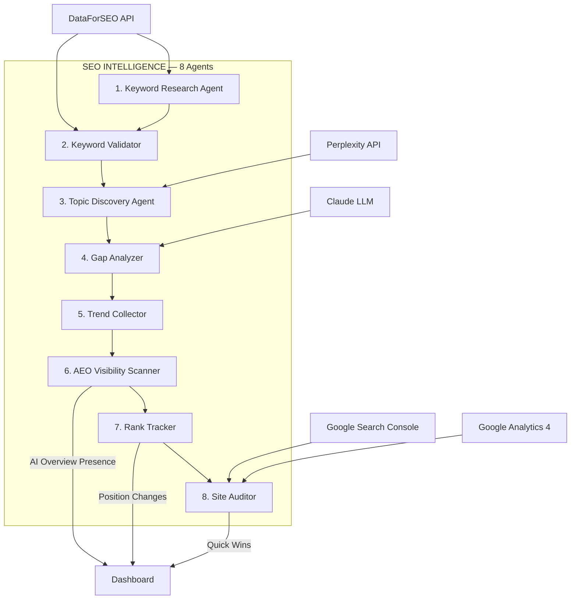
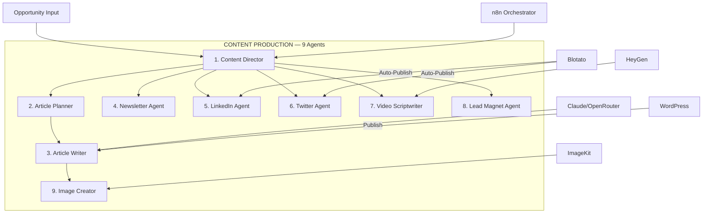
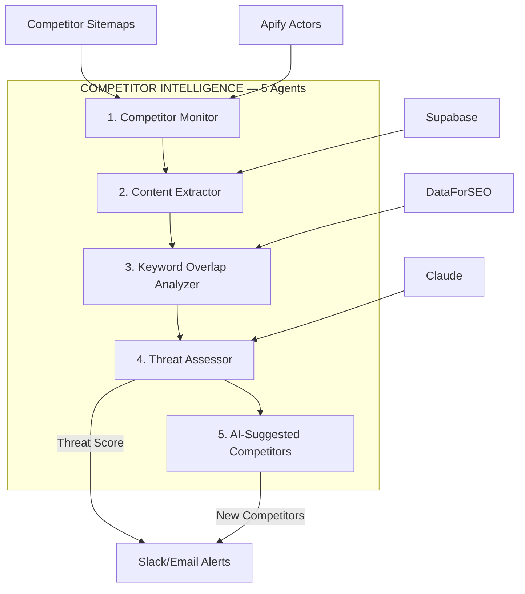
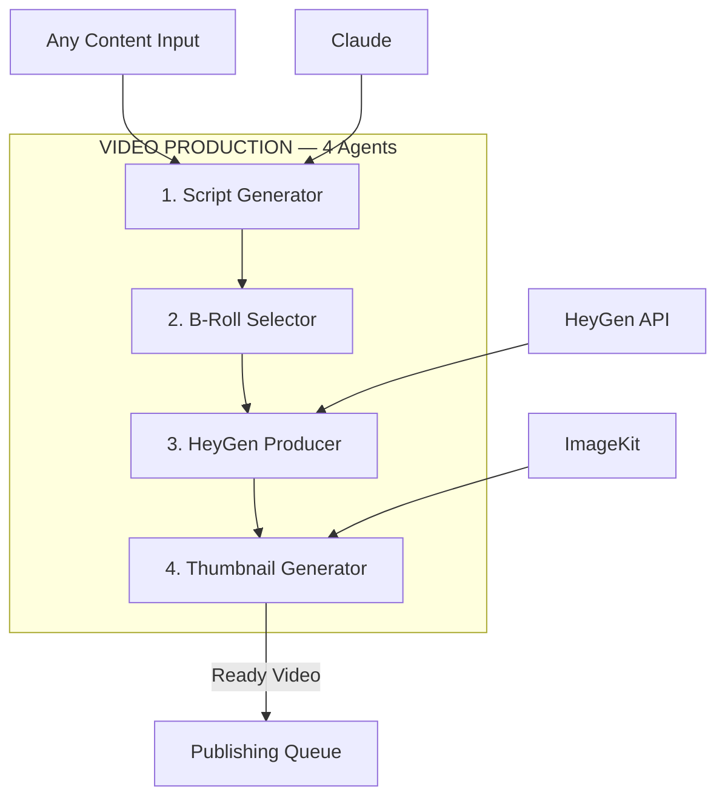
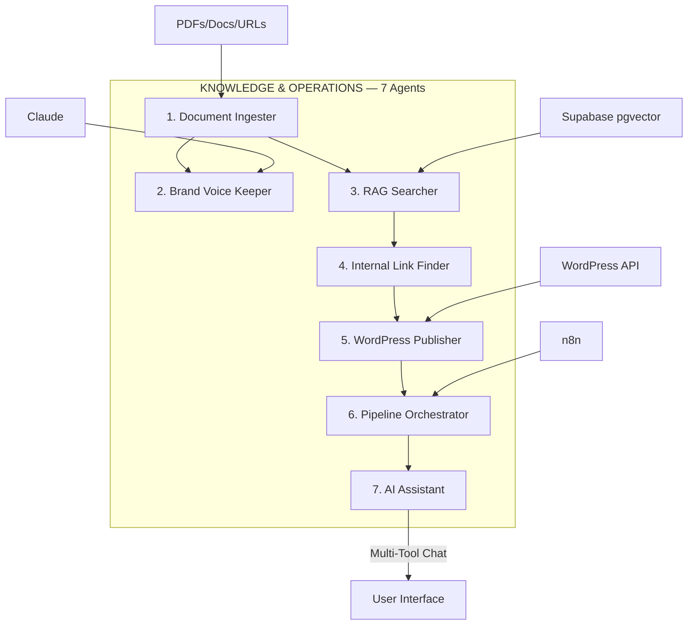
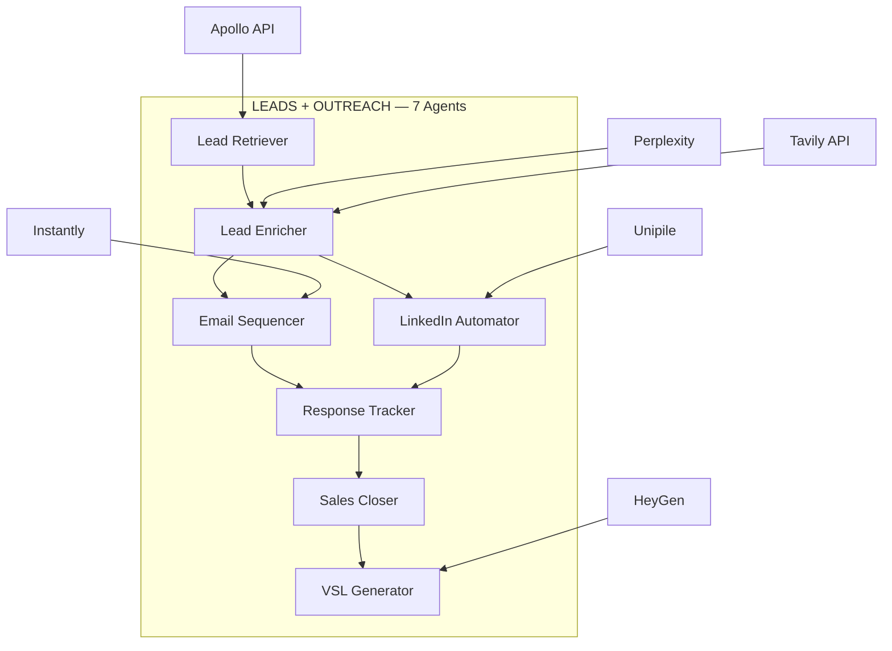
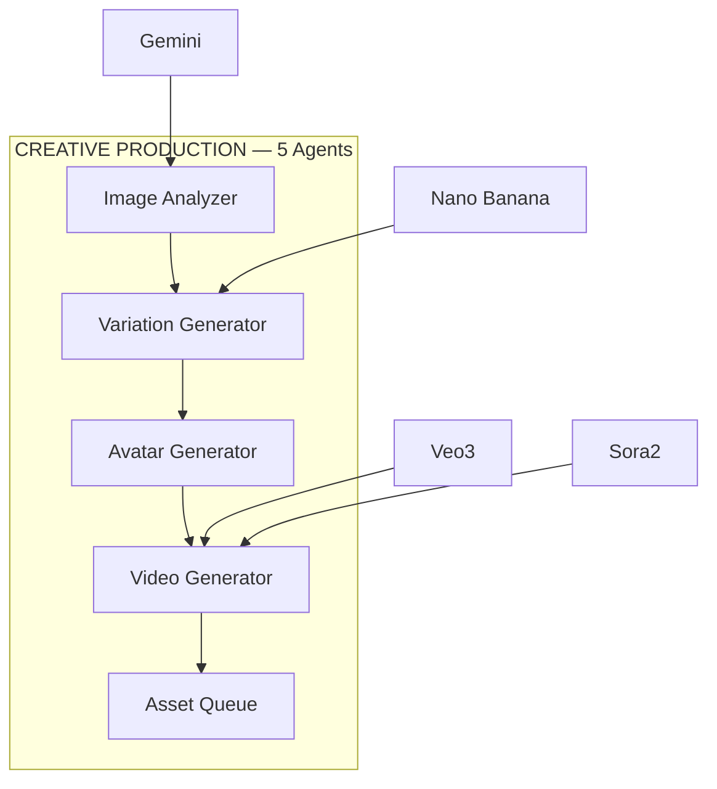
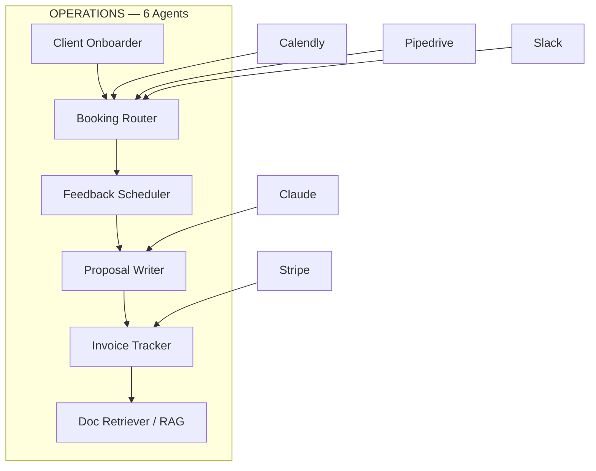

# AI TOPIA FULL RECON SPEC
## SUMMIT Dispatch Document — March 27, 2026

---

## 1. SITE INFRASTRUCTURE

```yaml
domain: getaitopia.io
framework: Next.js (App Router)
build_id: aPESXUwBLNw7TbYEvcGKl
hosting: Vercel (inferred from Next.js + _next patterns)
css: /_next/static/css/cf7dbfdfa5b3f550.css
font: Single custom woff2 (e4af272ccee01ff0-s.p.woff2)
analytics: GA4 G-B54J0XBMZ4
visitor_id: Reb2b Q6J2RH2VLL6D (B2B company identification pixel)
google_verification: M_7LeTy8cNrWR_Zp4Ktzj5D7s96r8xvkCJrvWHX6d-w
schema_org: WebSite + Organization
emails:
  - joon@getaitopia.io (public)
  - joon@aitopia.biz (footer mailto)
  - admin@getaitopia.io (schema contactPoint)
social:
  - x.com/aipreneur_j
  - threads.com/@aipreneur_j
  - youtube.com/@AIpreneur-J
  - linkedin.com/in/joonhyeok-ahn
sales: calendly.com/joon-getaitopia/30min
```

## 2. ROBOTS.TXT (HIDDEN PATHS)

```
User-agent: *
Allow: /
Disallow: /api/     ← HIDDEN API LAYER
Disallow: /admin/   ← ADMIN PANEL EXISTS
```

**Findings:** Backend API exists at `/api/` (blocked from crawlers). Admin panel at `/admin/`. Both return 404 to direct probe — likely auth-gated or SSR-protected.

## 3. COMPLETE SITEMAP (44 URLs)

```yaml
# CORE PAGES (priority 0.9-1.0)
pages:
  - url: /
    priority: 1.0
    freq: daily
  - url: /services/ai-cmo
    priority: 0.9
    freq: weekly

# USE CASES
  - url: /ai-stack
  - url: /ai-for-marketing
  - url: /ai-for-sales
  - url: /ai-for-operations
  - url: /custom-ai-solutions

# RESOURCES
  - url: /resources
    freq: daily
  - url: /resources/n8n-workflows
  - url: /resources/ai-first-whitepaper
  - url: /resources/white-papers
  - url: /resources/ai-readiness-assessment

# COMMUNITY & META
  - url: /community
  - url: /roadmap
  - url: /blog
    freq: daily

# BLOG POSTS (16 articles)
  - url: /blog/ai-agents-for-marketing
  - url: /blog/ai-content-detectors-explained-2026
  - url: /blog/ai-content-engine-marketing-automation
  - url: /blog/ai-driven-marketing-automation-guide
  - url: /blog/ai-invoice-payment-automation
  - url: /blog/ai-marketing-teams-cost-reduction-reality-vs-hype
  - url: /blog/ai-powered-seo-automation-guide
  - url: /blog/ai-sales-automation-revenue-strategy
  - url: /blog/ai-sdr-agents-outbound-sales
  - url: /blog/automate-client-onboarding-gohighlevel
  - url: /blog/automation-roi-cost-savings-guide
  - url: /blog/best-free-ai-tools-digital-marketing
  - url: /blog/competitor-monitoring-automation
  - url: /blog/heygen-ai-video-automation
  - url: /blog/reddit-social-media-marketing-b2b-guide

# FREE TOOLS (12 tools!)
  - url: /tools/content-score        # Content Score Grader
  - url: /tools/aeo-check            # AEO Readiness Checker
  - url: /tools/quick-wins           # Quick Wins Finder
  - url: /tools/content-gap          # Content Gap Analyzer
  - url: /tools/subreddit-finder     # Subreddit Finder
  - url: /tools/influencer-finder    # Influencer Finder
  - url: /tools/roi-calculator       # ROI Calculator
  - url: /tools/brand-mention-tracker # Brand Mention Tracker
  - url: /tools/linkedin-post-analyzer # LinkedIn Post Analyzer
  - url: /tools/headline-tester      # Headline Tester
  - url: /tools/marketing-stack-audit # Marketing Stack Audit
  - url: /tools/reddit-intent-signals # Reddit Intent Signals

# LEGAL
  - url: /privacy-policy
  - url: /terms-of-use
  - url: /cookie-policy

# HIDDEN (not in sitemap, found via navigation)
  - url: /agent-map.html    # Interactive agent visualization
  - url: /api/              # Backend API (blocked)
  - url: /admin/            # Admin panel (blocked)
```

**TOTAL: 44 sitemap URLs + 3 hidden = 47 known endpoints**

## 4. ALL AGENTS MAPPED (Comprehensive)

### Pillar 1: SEO Intelligence (8 Agents)



**Workflow:** Seeds → Cluster → Validate Metrics → Gap vs Competitors → Track Trends → Monitor AEO → Track Rankings → Audit Site Health

**Tools:** DataForSEO ($50-80/mo), GSC (free), GA4 (free), Perplexity ($20/mo), Claude

### Pillar 2: Content Production (9 Agents)



**Workflow:** Director receives scored opportunity → dispatches 6+ specialist agents in parallel → each produces format-specific content → Image Creator adds visuals → all queued for review/publish

**Tools:** Claude/OpenRouter ($100-300/mo), HeyGen ($29-89/mo), WordPress (client's), n8n, ImageKit, Blotato ($19-49/mo)

### Pillar 3: Competitor Intelligence (5 Agents)



**Workflow:** Daily crawl competitor sitemaps → extract content metadata → cross-reference keywords → score threat level → discover unknown competitors via AI

**Tools:** DataForSEO (shared), Apify ($49+/mo), Claude, Supabase

### Pillar 4: Video Production (4 Agents)



**Workflow:** Content input → script adaptation → B-roll matching → HeyGen avatar render → thumbnail creation

**Tools:** HeyGen (shared), ImageKit, Claude

### Pillar 5: Knowledge & Operations (7 Agents)



**Workflow:** Ingest documents → vector embeddings → brand voice enforcement → RAG context injection → internal linking → WordPress publish → full pipeline orchestration → AI assistant interface

**Tools:** Supabase pgvector ($25/mo), Claude, WordPress, n8n

### ADDITIONAL: Sales + Outreach Stack (from /ai-stack page)



### ADDITIONAL: Creative Production (from /ai-stack page)



### ADDITIONAL: Operations (from /ai-stack page)



## 5. COMPLETE AGENT REGISTRY

```yaml
# TOTAL: 47 named agents across 8 departments
pillar_1_seo:
  - Keyword Research Agent
  - Keyword Validator
  - Topic Discovery Agent
  - Gap Analyzer
  - Trend Collector
  - AEO Visibility Scanner
  - Rank Tracker
  - Site Auditor

pillar_2_content:
  - Content Director
  - Article Planner
  - Article Writer
  - Newsletter Agent
  - LinkedIn Agent
  - Twitter Agent
  - Video Scriptwriter
  - Lead Magnet Agent
  - Image Creator

pillar_3_competitor:
  - Competitor Monitor
  - Content Extractor
  - Keyword Overlap Analyzer
  - Threat Assessor
  - AI-Suggested Competitors

pillar_4_video:
  - Script Generator
  - B-Roll Selector
  - HeyGen Producer
  - Thumbnail Generator

pillar_5_knowledge:
  - Document Ingester
  - Brand Voice Keeper
  - RAG Searcher
  - Internal Link Finder
  - WordPress Publisher
  - Pipeline Orchestrator
  - AI Assistant

dept_sales:
  - Lead Retriever
  - Lead Enricher
  - Email Sequencer
  - LinkedIn Automator
  - Response Tracker
  - Sales Closer
  - VSL Generator

dept_creative:
  - Image Analyzer
  - Variation Generator
  - Avatar Generator
  - Video Generator
  - Asset Queue

dept_operations:
  - Client Onboarder
  - Booking Router
  - Feedback Scheduler
  - Proposal Writer
  - Invoice Tracker
  - Doc Retriever
```

## 6. TOOL DEPENDENCY MAP

```yaml
paid_tools:
  - DataForSEO: $50-80/mo (SEO data)
  - Apify: $49+/mo (web scraping actors)
  - HeyGen: $29-89/mo (AI video)
  - Blotato: $19-49/mo (social publishing)
  - OpenRouter/Claude: $100-300/mo (LLM)
  - Perplexity: $20/mo (research)
  - Apollo: unknown (lead data)
  - Instantly: unknown (cold email)
  - Unipile: unknown (LinkedIn automation)
  - Tavily: unknown (search API)

free_tools:
  - Google Search Console
  - Google Analytics 4
  - n8n (self-hosted)
  - WordPress (client's)
  - Supabase (pgvector)
  - ImageKit (free tier)

infrastructure:
  - Frontend: Next.js + React + TypeScript + Tailwind + Radix UI
  - AI Framework: Python + Agno Framework + FastAPI
  - Database: Supabase (PostgreSQL + pgvector + RLS)
  - Orchestration: n8n (primary)
  - Hosting: Vercel (inferred)
  - Tracking: GA4 + Reb2b (B2B visitor identification)
```

## 7. FREE TOOLS ANALYSIS (12 Lead Magnets)

```yaml
# They have 12 free tools (sitemap shows more than website navigation reveals!)
tools_on_website_nav: # 7 (shown in footer)
  - Content Score Grader (/tools/content-score)
  - AEO Readiness Checker (/tools/aeo-check)
  - Quick Wins Finder (/tools/quick-wins)
  - Content Gap Analyzer (/tools/content-gap)
  - Subreddit Finder (/tools/subreddit-finder)
  - Influencer Finder (/tools/influencer-finder)
  - AI Readiness Assessment (/resources/ai-readiness-assessment)

tools_hidden_in_sitemap: # 5 additional (not in nav!)
  - ROI Calculator (/tools/roi-calculator)
  - Brand Mention Tracker (/tools/brand-mention-tracker)
  - LinkedIn Post Analyzer (/tools/linkedin-post-analyzer)
  - Headline Tester (/tools/headline-tester)
  - Marketing Stack Audit (/tools/marketing-stack-audit)
  - Reddit Intent Signals (/tools/reddit-intent-signals)
```

## 8. SUMMIT DISPATCH SPEC

```yaml
dispatch_to: Claude Code on Hetzner
repo: breverdbidder/zonewise-gtm
branch: feat/ai-topia-recon

tasks:
  - Save this spec as docs/recon/AITOPIA-RECON.md
  - Create docs/recon/agent-map.mermaid with all 8 Mermaid diagrams
  - Create docs/recon/tool-matrix.yaml with full dependency map
  - Create docs/recon/free-tools-analysis.md with all 12 tools documented
  - Create docs/gtm/BLUEPRINT-OUTLINE.md adapting their sales doc structure
  - Create TODO.md with build plan from marketing-vs-marketing battle card
  - Push all to GitHub
```
